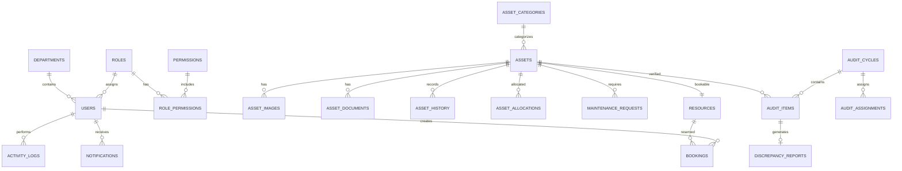

# AssetFlow
# Entity Relationship Diagram (ERD) Specification

---

Document ID: AF-ERD-001

Version: 1.0

Status: Draft

Project: AssetFlow – Enterprise Asset & Resource Management System

References

- AF-PRD-001
- AF-SRS-001
- AF-ARCH-001
- AF-DB-001

---

# Table of Contents

1. Purpose
2. ERD Overview
3. Core Domains
4. Entity Relationships
5. Cardinality
6. Database Schema Overview
7. Relationship Rules
8. Cascade Rules
9. Future Expansion

---

# 1. Purpose

This document defines every entity and relationship inside the AssetFlow system.

The ERD acts as the blueprint for

- Prisma Schema
- PostgreSQL Database
- Backend Development
- API Design
- Business Logic

---

# 2. High-Level ER Diagram

```

Organization

│

├───────────────┐

│               │

Departments   Roles

│               │

│               │

Users───────────┘

│

│

Assets────────────Categories

│

├──────────Images

├──────────Documents

├──────────History

├──────────Allocations

├──────────Maintenance

├──────────Audit Items

│

Resources

│

Bookings

│

Notifications

│

Activity Logs

```

---

# 3. Domain Breakdown

The system is divided into seven business domains.

## Domain 1

Identity & Access

Entities

- Users
- Roles
- Permissions
- RolePermissions

---

## Domain 2

Organization

Entities

- Departments
- Asset Categories

---

## Domain 3

Asset Management

Entities

- Assets
- Asset Images
- Asset Documents
- Asset History

---

## Domain 4

Operations

Entities

- Asset Allocations
- Transfer Requests
- Bookings
- Maintenance Requests

---

## Domain 5

Audit

Entities

- Audit Cycles
- Audit Assignments
- Audit Items
- Discrepancy Reports

---

## Domain 6

Communication

Entities

- Notifications
- Activity Logs

---

## Domain 7

Reporting

Materialized Views

Dashboard Views

Analytics Views

---

# 4. Entity Relationships

---

## Department

```
Department

1

↓

Many

Users
```

Relationship

One department contains many employees.

---

## Department

```
Department

1

↓

Many

Audit Cycles
```

---

## Department

```
Department

1

↓

Many

Assets
```

Future Enhancement

Currently assets use location instead of ownership.

---

## Role

```
Role

1

↓

Many

Users
```

---

## Role

```
Role

Many

↓

Many

Permissions
```

Implemented through

RolePermissions

---

## Category

```
Category

1

↓

Many

Assets
```

---

## Asset

```
Asset

1

↓

Many

Images
```

---

## Asset

```
Asset

1

↓

Many

Documents
```

---

## Asset

```
Asset

1

↓

Many

History Records
```

---

## Asset

```
Asset

1

↓

Many

Maintenance Requests
```

---

## Asset

```
Asset

1

↓

Many

Allocation Records
```

---

## Asset

```
Asset

1

↓

Many

Audit Items
```

---

## Asset

```
Asset

1

↓

1

Resource

(Optional)

Only Bookable Assets
```

---

## Resource

```
Resource

1

↓

Many

Bookings
```

---

## Booking

```
Booking

Many

↓

1

User
```

---

## Maintenance

```
Maintenance Request

Many

↓

1

User

(Reported By)
```

---

## Maintenance

```
Maintenance Request

Many

↓

1

Technician

(Assigned To)
```

---

## Audit Cycle

```
Audit Cycle

1

↓

Many

Audit Items
```

---

## Audit Cycle

```
Audit Cycle

1

↓

Many

Audit Assignments
```

---

## Audit Item

```
Audit Item

1

↓

0..1

Discrepancy Report
```

---

## User

```
User

1

↓

Many

Notifications
```

---

## User

```
User

1

↓

Many

Activity Logs
```

---

# 5. Cardinality Matrix

| Parent | Child | Cardinality |
|----------|---------|-------------|
| Department | Users | 1 : N |
| Department | Audit Cycles | 1 : N |
| Role | Users | 1 : N |
| Role | Permissions | N : N |
| Category | Assets | 1 : N |
| Asset | Images | 1 : N |
| Asset | Documents | 1 : N |
| Asset | History | 1 : N |
| Asset | Maintenance | 1 : N |
| Asset | Allocation | 1 : N |
| Asset | Audit Items | 1 : N |
| Asset | Resource | 1 : 0..1 |
| Resource | Bookings | 1 : N |
| User | Bookings | 1 : N |
| User | Notifications | 1 : N |
| User | Logs | 1 : N |
| Audit Cycle | Audit Items | 1 : N |
| Audit Cycle | Assignments | 1 : N |
| Audit Item | Discrepancy | 1 : 0..1 |

---

# 6. Business Relationship Rules

## ER-001

Department must exist before Employee.

---

## ER-002

Role must exist before User.

---

## ER-003

Category must exist before Asset.

---

## ER-004

Asset must exist before

- Allocation
- Maintenance
- Booking
- Audit

---

## ER-005

Audit Cycle must exist before Audit Items.

---

## ER-006

Resource cannot exist without Asset.

---

## ER-007

Discrepancy Report cannot exist without Audit Item.

---

# 7. Cascade Rules

| Parent | Delete Action |
|----------|---------------|
| Department | Restrict |
| Role | Restrict |
| User | Soft Delete |
| Asset | Soft Delete |
| Category | Restrict |
| Resource | Cascade |
| Booking | Cascade |
| Audit Cycle | Restrict |

---

# 8. Foreign Key Dependency

```
Departments

↓

Users

↓

Allocations

↓

Activity Logs

```

---

```
Categories

↓

Assets

↓

Resources

↓

Bookings

```

---

```
Assets

↓

Maintenance

↓

Audit Items

↓

Reports

```

---

# 9. Normalization

The database follows Third Normal Form (3NF).

## First Normal Form

✓ Atomic values

✓ No repeating groups

---

## Second Normal Form

✓ Full dependency on primary key

---

## Third Normal Form

✓ No transitive dependency

---

# 10. Entity Ownership

| Entity | Owner Module |
|----------|--------------|
| Users | Identity |
| Roles | Identity |
| Permissions | Identity |
| Departments | Organization |
| Categories | Organization |
| Assets | Asset |
| Images | Asset |
| Documents | Asset |
| History | Asset |
| Allocations | Allocation |
| Transfers | Allocation |
| Resources | Booking |
| Bookings | Booking |
| Maintenance | Maintenance |
| Audit Cycles | Audit |
| Audit Items | Audit |
| Notifications | Notification |
| Activity Logs | Core |

---

# 11. Aggregate Roots (DDD)

To maintain consistency, each domain has a single Aggregate Root.

| Aggregate | Root Entity |
|------------|-------------|
| Identity | User |
| Organization | Department |
| Asset | Asset |
| Allocation | AssetAllocation |
| Booking | Booking |
| Maintenance | MaintenanceRequest |
| Audit | AuditCycle |
| Notification | Notification |

Only Aggregate Roots expose repositories.

Child entities are modified through their Aggregate Root.

---

# 12. Recommended Database Schema

```
public

├── users

├── roles

├── permissions

├── role_permissions

├── departments

├── asset_categories

├── assets

├── asset_images

├── asset_documents

├── asset_history

├── asset_allocations

├── transfer_requests

├── resources

├── bookings

├── maintenance_requests

├── maintenance_history

├── audit_cycles

├── audit_assignments

├── audit_items

├── discrepancy_reports

├── notifications

└── activity_logs

```

---

# 13. Future Entities

Version 2

- Vendors
- Purchase Orders
- Warehouses
- Inventory
- Stock
- Depreciation
- Insurance
- Warranty Claims
- Cost Centers
- Mobile Devices
- RFID Tags
- Asset Groups

---

# 14. Mermaid ER Diagram



---

# 15. Next Document

AF-BE-001

Backend Architecture & Folder Structure

---

End of Entity Relationship Specification